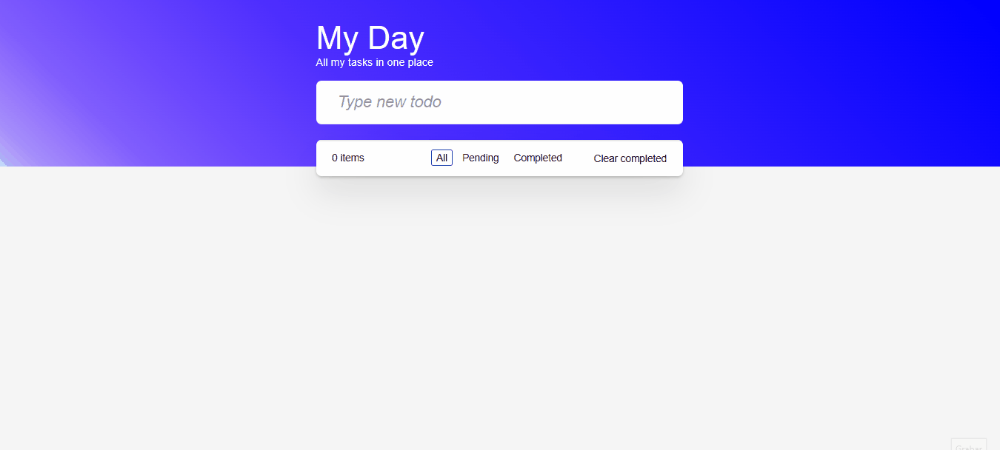

# MyDayApp.

Proyecto realizado con el objetivo de aprender los fundamentos de Angular, en donde se hace un registro de actividades en el día.

En este proyecto se aprendió los siguientes fundamentos:

- Crear un proyecto en angular.
- Crear componentes.
- Establecer rutas.
- Propiedades binding.
- Eventos binding.
- Modelo de reactividad con Signals.
- Directivas de control.
- Formcontrol.
- Estados compuestos con computed.
- Effect para el uso de localstorage.
- NgBuild.
- Despliegue con Firebase Hosting.

## Pasos para bajar el repositorio.

1. Clonar el repo con git.
1. Ejecutar comando **npm install**.
1. Correr la app con **ng serve**

## Funcionamiento.

